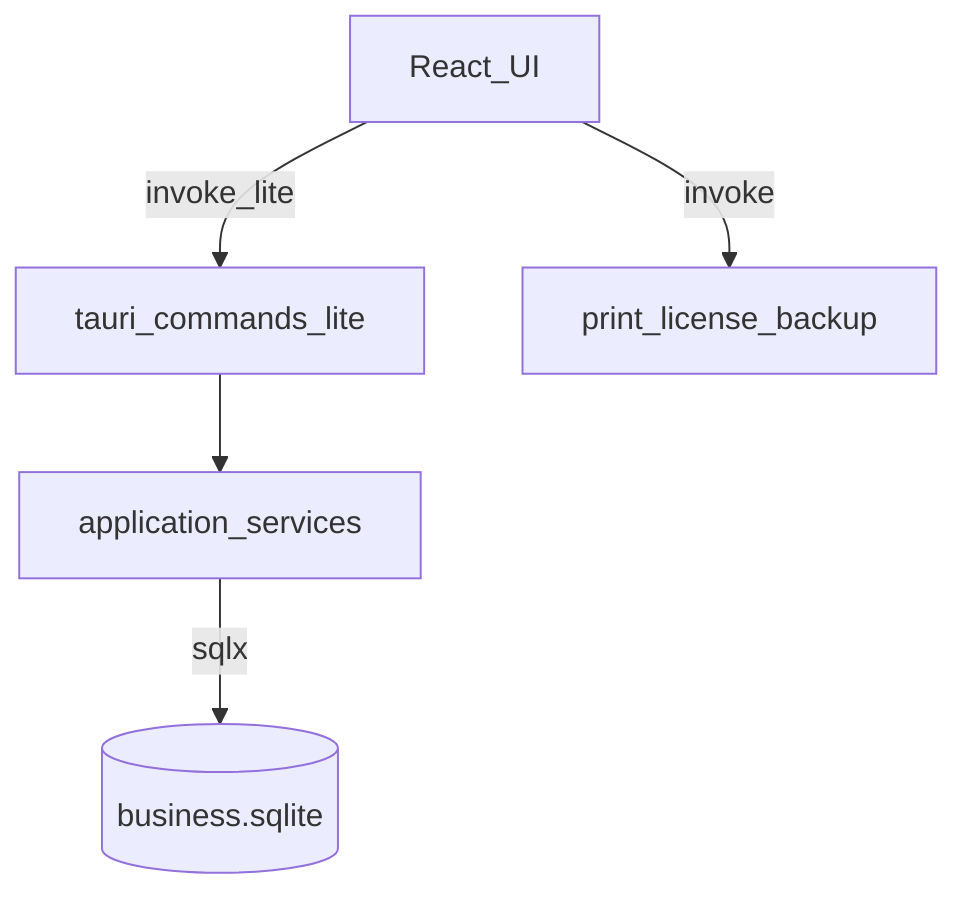

# 01 — Arquitectura objetivo

## Vista lógica (post cutover)

```text
KaiStore Lite
├── Shell Tauri (ventana, tray, lifecycle)
├── UI Vite + React + @kai/ui
│   ├── POS / Admin  → invoke("lite_*")
│   └── Impresoras / licencia / backup → invoke (existente)
├── Lite backend (Rust in-process)
│   ├── commands/          # serde in/out
│   ├── application/       # casos de uso
│   └── db/                # sqlx pool + migrations + queries
└── SQLite (Application Support / XDG)
```

## Diagrama



## Capas Rust (paths previstos)

```text
src-tauri/src/
  lite/
    mod.rs
    commands/
      mod.rs
      auth.rs
      health.rs
      catalog.rs
      stock.rs
      commerce.rs
      ops.rs
      seed.rs
    application/
      mod.rs
      auth.rs
      catalog.rs
      stock.rs
      commerce.rs
      ops.rs
      seed.rs
    db/
      mod.rs
      pool.rs
      migrations/   # o sqlx migrate folder
      queries/
```

## Comparación con hoy

| Hoy (sidecar) | Objetivo |
|---------------|----------|
| HTTP `127.0.0.1:4100/api/lite/*` | `invoke("lite_…")` |
| Nest + TypeORM | sqlx |
| Node embebido en resources | Sin Node |
| Winston `logs/` en cwd | tracing → app-data |

## Pool y ciclo de vida

1. `setup` Tauri: abrir pool sqlx sobre `business_db_path()`, correr migraciones.
2. Guardar `Pool<Sqlite>` en `tauri::State` o `OnceCell`.
3. On exit: drop pool (sidecar `stop_core_lite` deja de aplicar).

## Errores hacia UI

Mapear a `{ code, message }` JSON estable (paridad con errores HTTP Lite: 401, 404, 400). Documentar códigos en cada paso.
